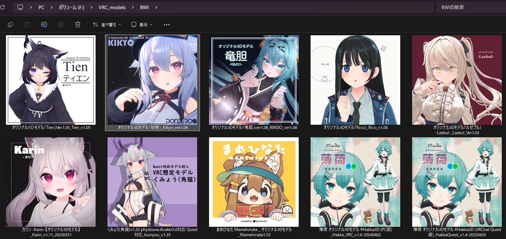
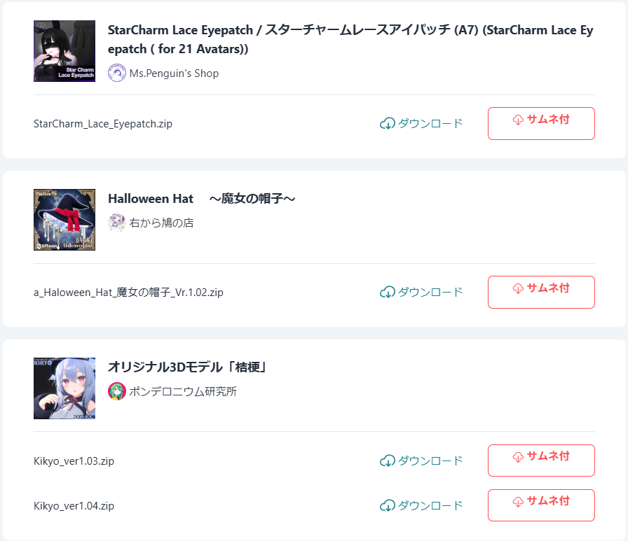
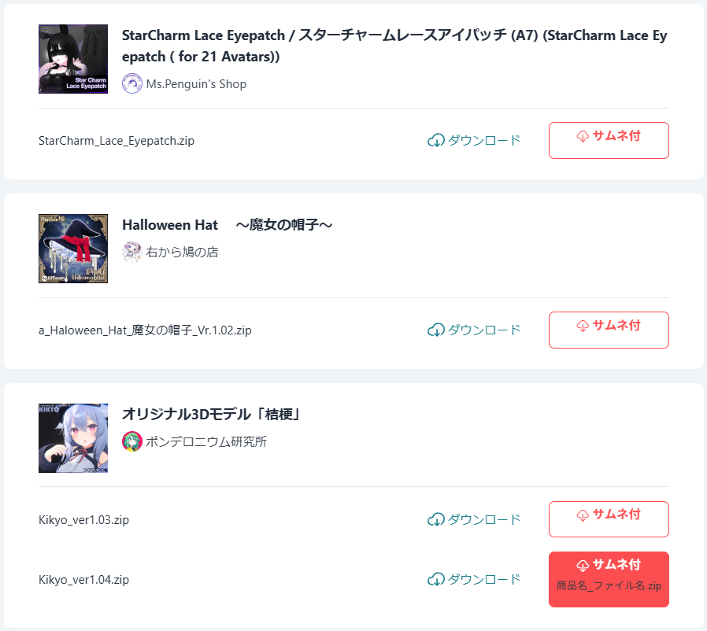
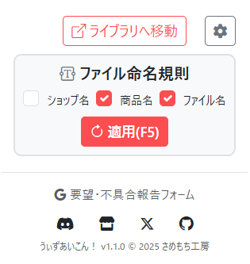
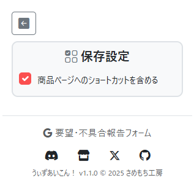
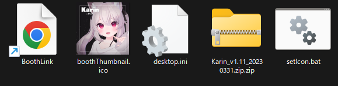
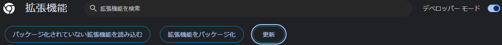
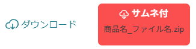

# VRC向けアセット管理ツール うぃずあいこん！

Boothで購入したアセットの管理において、こんな課題はありませんか？

-   **ファイル名やフォルダの見た目では、どんな商品だったか判別しにくい。**
-   **多数のアセットを手作業で管理ツールに登録するのが大変。**

### このChrome拡張機能を使うと，以下のようにアイコン付きフォルダにアイコンを設定できます．
Boothでも公開中！(https://hrsm.booth.pm/items/6857517)

  
      
<em>Windows エクスプローラー画面(フォルダアイコン設定後)</em>

<table align="center" width="100%">
  <tr>
    <td align="center">
      
      
<em>Boothのライブラリ画面</em>

    </td>
    <td align="center">
      
      
<em>ボタンへのマウスホバーで命名規則を表示</em>

    </td>
  </tr>
</table>

## 特徴
- クリックだけで設定可能！アイコン設定スクリプトをクリックするだけです．
- 専用アプリケーション不要！Windows標準エクスプローラーで管理します．
- 商品リンクをフォルダに同封！Boothでの検索が不要です．
- 無料商品，有料商品の両方に対応！

## 主な機能

## ① 命名規則に基づいたzip形式でのダウンロード

Boothのライブラリから、統一した命名規則でアセットをダウンロードできます。

以下から選択した要素が命名規則に含まれます．
- `<ショップ名>`
- `<商品名>`
- `<ファイル名>`

**例：`<ショップ名>_<商品名>_<ファイル名>.zip`**

<table align="center">
  <tr>
    <td>
      
      
<em>ファイル名の命名規則は設定画面で変更可能</em>

    </td>
  </tr>
</table>

## ② フォルダアイコンへのサムネイル設定

ダウンロードしたzipを展開

↓

同梱のスクリプト(setIcon.bat)を実行

↓

フォルダに商品のサムネイル画像がアイコンとして設定されます。

## ③ 商品ページへのショートカットを同封
Boothの商品ページへのショートカットをzipに含めます．
設定から無効にも出来ます．
<table align="center">
  <tr>
    <td align="center">
      
      
<em>オプション画面(保存設定)</em>

    </td>
  </tr>
</table>

## ダウンロードされるzipファイルの内容

元の商品ファイルに加えて、管理を補助する以下のファイルが同梱されます。

  

-   **商品ファイル本体**
-   `BoothThumbnail.ico`：商品のサムネイルから作成されたアイコンファイル
-   `setIcon.bat`：フォルダにアイコンを設定するWindowsバッチスクリプト
-   `desktop.ini`：アイコン設定を保存する構成ファイル
-   `BoothLink.url`：商品ページへのショートカットリンク

 

## 導入 & 使い方

### Step 1: 導入方法
**Chrome Web Store版**
1.  以下のURLから「Chromeに追加」ボタンでインストールします．(https://chromewebstore.google.com/detail/oinabhdmojgikmdfaoibakddccgdfhpl?utm_source=item-share-cb)
 

**ローカルからインストールする場合**
1.  本リポジトリ or Booth商品ページ(https://hrsm.booth.pm/items/6857517)からzipをダウンロードします．
2.  本ツール（zipファイル）を展開（解凍）します。
3.  Google Chromeで「拡張機能の管理」ページ (`chrome://extensions`) を開きます。

  

4.  画面右上の **「デベロッパー モード」** をオンに切り替えます。
5.  画面左上の **「パッケージ化されていない拡張機能を読み込む」** をクリックします。
6. ファイル選択ダイアログで、手順1で展開したフォルダの中にある `dist` フォルダを選択します。

### Step 2: 使い方

1.  Boothの **購入履歴（ライブラリ）** ページ ( `https://accounts.booth.pm/library` ) を開きます。
2.  各商品に追加された専用のダウンロードボタンをクリックします。（ファイルの生成処理のため、ダウンロード開始まで少し時間が掛かります）

  

3.  ダウンロードしたzipファイルを任意の場所に展開（解凍）します。
4.  展開したフォルダ内にある **`setIcon.bat`** をダブルクリックして実行します。
5.  フォルダのアイコンが商品のサムネイルに設定されます。（OSによるキャッシュのため、アイコンの反映に時間が掛かる場合があります）

## 動作環境

-   **OS**
    -   **Windows 10 / 11 (必須)**
-   **ブラウザ**
    -   **Google Chrome (推奨)**
    -   Brave, Vivaldi での動作報告がありますが、公式な動作保証の対象外です。
-   **展開（解凍）ソフト**
    -   **7-Zip (推奨)**
    -   **【ご注意】** 一部の解凍ソフト（例: CubeICEなど）では、アイコン設定に必要な構成ファイル (`desktop.ini`) が展開時に削除される可能性が報告されています。